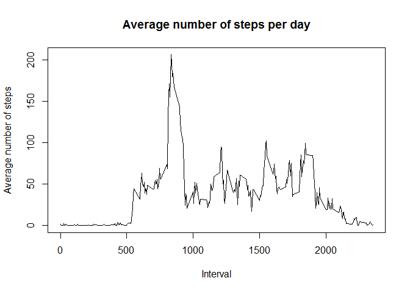
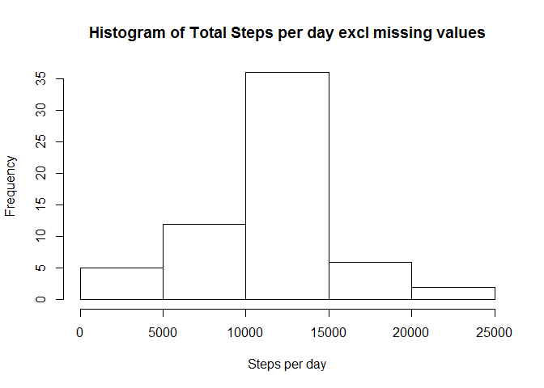
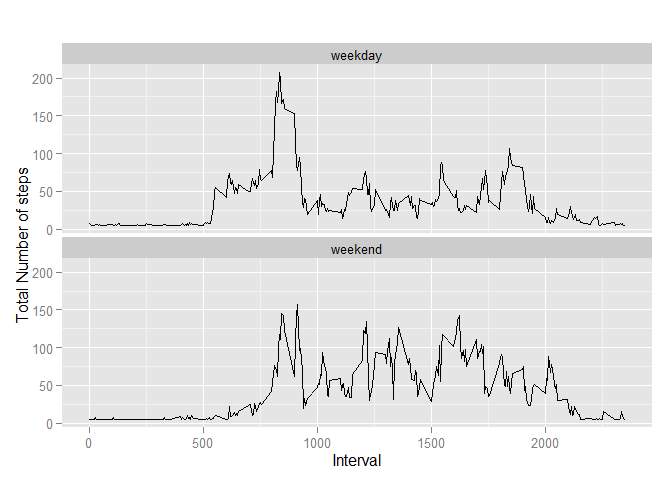

# Reproducible Research: Peer Assessment 1


## Loading and preprocessing the data

```r
# load libraries
library(ggplot2)
# read the file (it MUST have been downloaded already and be present in the working directory)
activitydata = read.csv("activity.csv")  # read csv file 
# create a dataset without NAs
activitydataClean <- na.omit(activitydata)
# return a dataset with data summarised by date and sum of steps
totalsteps <- aggregate(activitydataClean$steps, by=list(Category=activitydataClean$date), FUN=sum)
# display the histogram
hist(as.numeric(totalsteps$x),main="Histogram of total number of steps per day", xlab="Total number of steps in a day")
```

 


## What is mean total number of steps taken per day?

```r
# show the summary dataset of totalsteps - it contains the median and mean
summary(totalsteps)
```

```
##        Category        x        
##  2012-10-02: 1   Min.   :   41  
##  2012-10-03: 1   1st Qu.: 8841  
##  2012-10-04: 1   Median :10765  
##  2012-10-05: 1   Mean   :10766  
##  2012-10-06: 1   3rd Qu.:13294  
##  2012-10-07: 1   Max.   :21194  
##  (Other)   :47
```

## What is the average daily activity pattern?

```r
# return a dataset with data summarised by interval and mean of steps
StepsByInterval <- aggregate(steps ~ interval, activitydataClean, mean)
# display a plot with average steps per day
plot(StepsByInterval$interval, StepsByInterval$steps, type='l',main="Average number of steps per day", xlab="Interval",
     ylab="Average number of steps")
```

 

```r
# get the record with the most steps
StepsByInterval[which.max(StepsByInterval$steps),]
```

```
##     interval    steps
## 104      835 206.1698
```
The interval 835 has the most steps(206.1698113)


```r
# get the total number of records with NA values
sum(is.na(activitydata))
```

```
## [1] 2304
```
There are 2304 number of records with missing values

## Imputing missing values
The strategy used to impute missing values is to replace the NA values for steps with the mean value for steps for the dataset

```r
# create a new dataset to contain imputed data
activitydataImputed <- activitydata
# impute NA values using the mean of steps to replace NA values
activitydataImputed$steps[is.na(activitydataImputed$steps)] = mean(activitydataImputed$steps, na.rm=TRUE)
# now summarise imputed dataset to get the sum of steps by date
ImputedStepsByDay <- aggregate(steps ~ date, activitydataImputed, sum)
# display a histogram to show the total steps per day
hist(ImputedStepsByDay$steps, main="Histogram of Total Steps per day excl missing values",xlab="Steps per day")
```

 

```r
# show the mean and median values using the summary function
summary(ImputedStepsByDay$steps)
```

```
##    Min. 1st Qu.  Median    Mean 3rd Qu.    Max. 
##      41    9819   10770   10770   12810   21190
```


## Are there differences in activity patterns between weekdays and weekends?

```r
# add a new column to the dataset to categorise the week day
activitydataImputed['DayCategory'] <- weekdays(as.Date(activitydataImputed$date))
# categorise weekend and weekday based on the day of week text
activitydataImputed$DayCategory[activitydataImputed$DayCategory  %in% c('Saturday','Sunday') ] <- "weekend"
activitydataImputed$DayCategory[!(activitydataImputed$DayCategory  %in% c('Saturday','Sunday','weekend')) ] <- "weekday"
# specify the new column as a factor
activitydataImputed$DayCategory <- as.factor(activitydataImputed$DayCategory)
# create a summarised dataset with the mean of steps by interval and Day Category
ImputedStepsByInterval <- aggregate(steps ~ interval + DayCategory, activitydataImputed, mean)
# create a plot of the summarised dataset
qplot(interval, steps, data = ImputedStepsByInterval, type = 'l', geom=c("line"),
      xlab = "Interval", 
      ylab = "Total Number of steps", main = "") +facet_wrap(~ DayCategory, ncol = 1)
```

 
